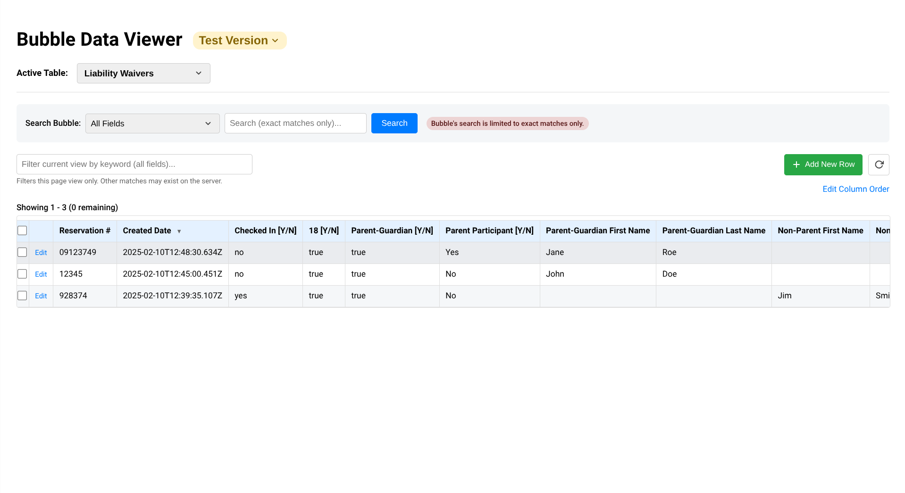
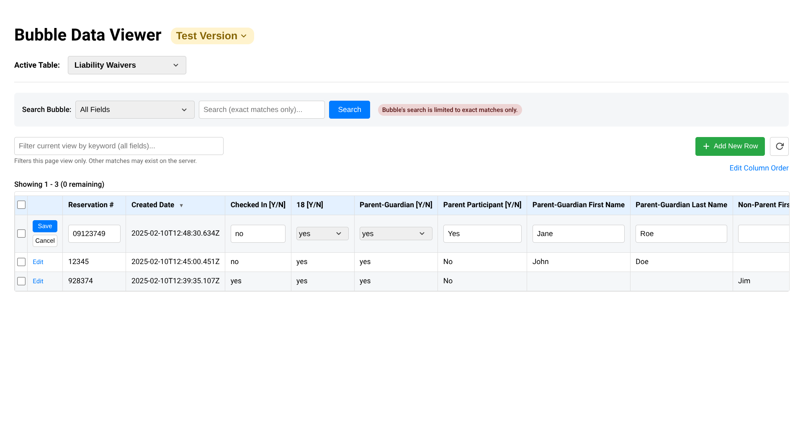
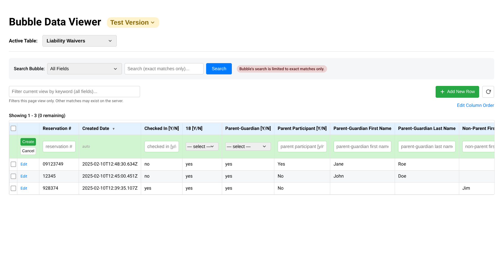
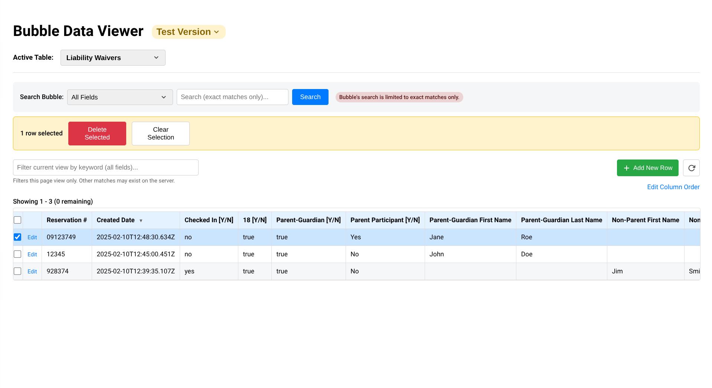
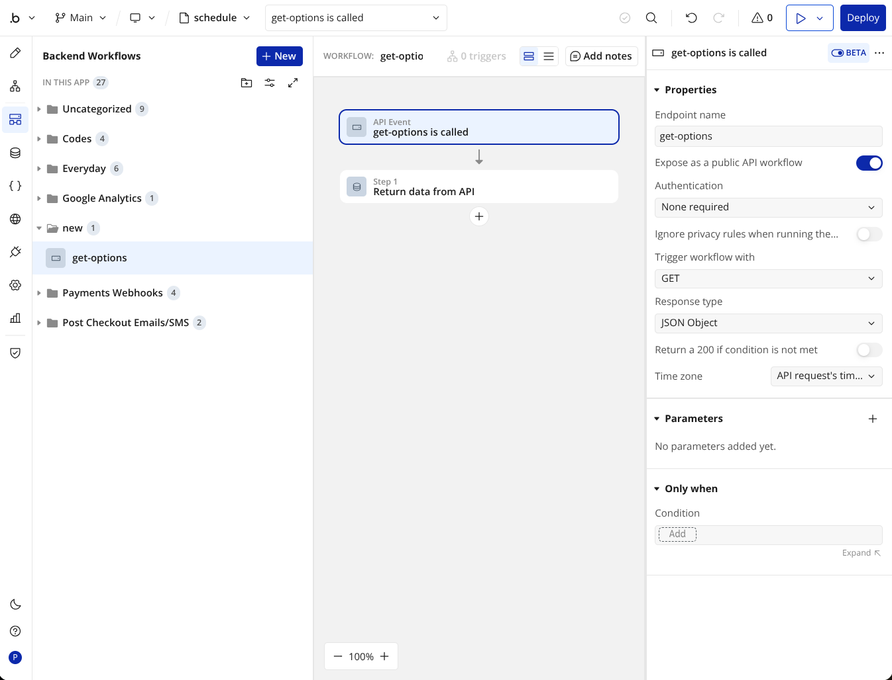
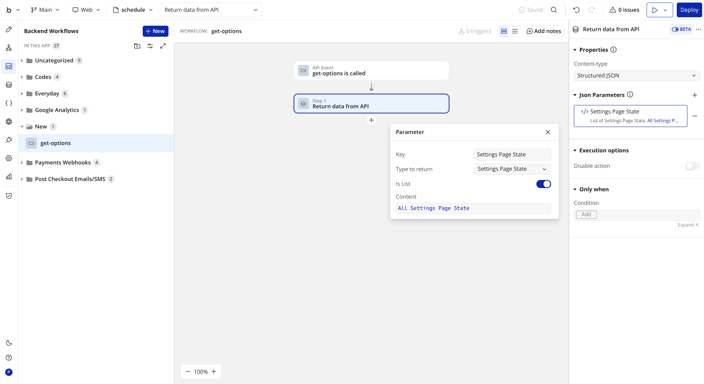

# Bubble App Data Manager
The default database admin UX in the bubble.io editor is terrible, and using Bubble to build admin pages with custom tables to manage your database is not much better. Bubble is not great at building tables for data, both because it requires tedious button clicking and because bubble's capabilities are extremely limited. However, nice tables are actually very easy to build with code.

_This improved database manager is a single .html file that can be opened in any browser to manage your bubble database, just like you're using a webpage, with very little setup. This is all frontend code and does not require a python server or any setup beyond editing the [bubble_data_manager.html](bubble_data_manager.html) file to use your app URL and API key. That's it. There are some more advanced features that can be added with less than 10 minutes of setup._ 
***Note: these screenshots are out of date. More features have been added***

## Features:
- Better UX for editing data than native bubble
- Automatically detects your app's data types and fields and requires very little setup
- Columns can be reordered and their position can be saved permanently
- Uses at least 10x less RAM than a bubble editor window in your browser
- Responsive design with no horizontal scroll glitches or bugs
- Preserve's Bubble's type safety and option sets can easily be loaded
- And most importantly, you have all of this code, with no weird front-end limitations, so adding or making changes to this (with your favorite AI) is easier, faster, and more customizable than using bubble

Limitations:
- The search uses bubble's exact string match search which sucks, the keyword filter has better substring searching but only searches the current page (100 rows). This could potentially be improved.
- Table data changes need to be refreshed manually unless you want to add webhooks and a python server to this.

## Setup:

### Prerequites: 
- This script relies on API access to your app. 'Enable Data API' and the checkbox for each data type you want to access must be checked in your Bubble apps Settings>API>Public API endpoints.
- Each field you want to access must have privacy permissions enabled for 'Find this in searches' or it will not be included in the table. 'Modify this via API' must be selected for every field you want to be able to edit.

Note: This does NOT require exposing your Swagger file, and it is generally recommended to select 'Hide Swagger API' in bubble's API settings.

### Basic Setup:
_[setup in >5 mins]_
- Download or copy [bubble_data_manager.html](bubble_data_manager.html) and insert your DOMAIN_NAME and API_TOKEN (Bubble Settings>API>Admin API Tokens) in the configuration section:

~~~javascript
        // --- CONFIGURATION ---
        let VERSION = ''; // Default database to load: test = '/version-test' ; live = ''
        const DOMAIN_NAME = 'yourdomain.com';
        let API_BASE_URL = `https://${DOMAIN_NAME}${VERSION}/api/1.1/obj/`;
        const API_TOKEN = '<your_API_key>';
        const EXCLUDED_TYPES = []; // list any data types you want this script to always ignore entirely
~~~

- Open the bubble_data_manager.html in any browser, and it will automatically connect to your database using your bubble API token and load all data types and fields that have the prerequisite API access and privacy permissions. It will behave near exactly as if the page was part of your bubble app, but you will not need to login as your API authentication is hardcoded.
Note: DO NOT SHARE THIS FILE after you add your API key and be careful where you store it. Anyone with access to this file will have access to your database.
- You can click 'edit column order' to drag and drop columns and create custom constraint and column filter views, but they will not be saved persistently until you follow the next step.

Edit rows right in the table view:

Create rows from the table view:

Delete Rows:

### Save Your Settings To Your Bubble Database:
  
Custom column reordering and constraint filter views will not be persistent unless a new fields is created in your bubble database to store this data:
  + Designate a bubble data type to store these settings in a permanent row (configured as 'APP_SETTINGS_TYPE' in bubble_data_manager.html) and make sure this data type has API access enabled in Bubble's settings
  + Add a text field named 'bubble data manager settings' to the data type you configure as the APP_SETTINGS_TYPE
  + That's it. Your contraint views and custom column reordering will be saved there and will load automatically
  + The live and test versions of your app will save different versions of your settings, so it is recommended to configure your constraint views and custom column orders in one version of your app, copy the data that is stored in the 'bubble data manager settings' field, and paste that data into the other version of your app.

### Load Option Sets:

Loading your app's option sets requires one extra step. This is not strictly necessary, but it makes it easier to edit fields that use option sets. [Everything works without importing option sets, but if you choose not to add option sets, editing fields that use option sets requires typing out option names exactly correct (or else saving changes will fail with an error message).] All of your app's option sets are public data that bubble does not allow you to hide, but it is not available by API, and your browser will block this script from attempting to pull it from your app's URL...So you could run a python server to scrape them or... just create and maintain a backend workflow API endpoint for your option sets. Fortunately, creating endpoint for options is very simple to do:
  + Create a public GET backend API workflow. No authentication is necessary because all of your option sets are always public. It must be named 'get-options' (or modify bubble_data_manager.html to use a different name):

  + Add each option set as a parameter. Set the key as the option set name, set 'is list', and set the content to all of that set's options:

Even with a large number of option sets, this does not take very long. 
That's it. Fields that use option sets will be detected and dropdowns will be provided to aid choosing options.
New option sets will need to be added to the API, however, individual options in a set update automatically once a set has been added.
